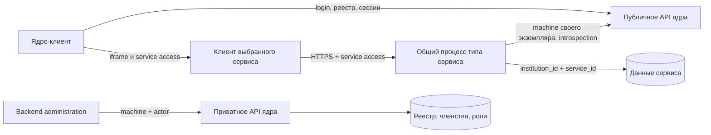

# Размещение облачных сервисов

Версия `0.1.0`, 26 сентября 2026. Общая схема для administration, schedule и user-profile. Это ответственность платформы; контракт универсального [SDK](sdk/SPEC.md) использует только доверенный binding. [Навигация](README.md).

## 1. Процесс и логические экземпляры

**Один процесс на тип облачного сервиса, а экземпляр вуза — запись и область данных внутри него.** Для ста вузов достаточно трёх процессов: administration, schedule, user-profile. При добавлении вуза или установке расписания новый процесс не запускается. Локальный coursework работает отдельным процессом на стороне вуза и использует тот же механизм сессий.

Экземпляр имеет UUID `service_id`, ровно один `institution_id` и фиксированный `service_type`. В MVP у вуза максимум один экземпляр каждого типа, как уже установлено ядром. Настройки, назначения ролей, записи расписания и анкеты разных экземпляров разделены. Общими являются исполняемый код, пул соединений и статические файлы клиента.

Это логическая изоляция данных, не отдельная машина на вуз. Ошибка или компрометация общего процесса может затронуть обслуживаемые им вузы. Поэтому объединять administration с обычными сервисами в один workload не предлагаем: только administration должен иметь сетевой доступ к приватному listener ядра. Один процесс **для всех вузов одного типа** решает исходную задачу без изменения этой границы.

Для MVP достаточно одного PostgreSQL: отдельные схемы и роли БД для ядра и каждого сервиса, без доступа сервиса к таблицам ядра. В будущем процессы можно размножить за балансировщиком, не меняя контракт или идентичность экземпляров. Состояние, влияющее на корректность, уже хранится в БД, а не в памяти процесса.

## 2. Доставка bindings

Процессу нужна привязка (`binding`) для каждого установленного экземпляра:

| Поле | Значение |
| --- | --- |
| `institution_id`, `service_id`, `service_type` | Неизменяемая идентичность экземпляра |
| `api_base_url`, `client_base_url` | Адреса из конфигурации платформы |
| `client_id`, защищённый machine secret | Credentials именно этого экземпляра |
| `binding_revision` | Версия доставки/ротации настроек |

Binding не принимается от браузера. Пользовательский JWT не создаёт binding и не регистрирует вуз. У процесса нет machine JWT «на все вузы»: для каждого обращения в ядро он выбирает credential по проверенному `service_id`.

Минимальный способ динамической доставки для облака — отдельная таблица конфигурации `provisioning.cloud_bindings` в том же PostgreSQL. Это **предложение внутреннего устройства платформы**, отсутствующее в текущем коде. Ядро при установке cloud записывает реестр, credential и binding в одной транзакции; облачный процесс имеет только SELECT собственных bindings, без доступа к core-таблицам. Доступ ограничивается типом сервиса средствами БД, а не одним WHERE в приложении: отдельные представления/права либо RLS с фиксированной ролью подключения. Administration не читает bindings остальных типов.

Machine secret хранится в этой области в зашифрованном виде; приватный ключ/ключ расшифрования своего типа доставляется процессу через секреты deployment. Для ядра достаточно ключа шифрования; в credential-таблице ядра остаётся только hash, как требует его спецификация. Используется готовый механизм защищённого хранения секретов, без собственного криптографического протокола. Secret не попадает в обычную конфигурацию клиента, API-ответы cloud, Git или логи. Это реализация уже предусмотренной «доставки credentials платформой», а не новый публичный API.

На запрос процесс получает binding из этой доверенной таблицы по проверенной паре UUID. Для небольшого MVP можно читать её на каждом запросе; отдельные очереди, polling workers, provisioning HTTP endpoints и согласование двух хранилищ не нужны. Доменные схемы подготовлены миграциями на весь тип: создание экземпляра не создаёт БД/схему/таблицы. Отсутствие доменных строк означает пустое расписание или незаполненную анкету.

Если требуется вынести ядро и сервисы в разные СУБД, такая транзакционная доставка перестанет работать; тогда потребуется отдельный механизм доставки. Это следующий этап, не скрытая зависимость MVP. Для локального coursework достаточно binding в серверной конфигурации вуза; секрет выдаётся по существующему API управления local credentials.

SDK получает результат разрешения binding из адаптера платформы; он не выдаёт credentials, не создаёт core-строки и не управляет ключами deployment. Local-адаптер получает тот же набор данных из защищённой конфигурации вуза. Это две реализации одного источника доверенных настроек, без отдельного provisioning API.

## 3. Жизненный цикл

### 3.1. Первый вуз

Оператор в рамках bootstrap ядра создаёт active вуз, первого owner, обязательный administration instance, его системные роли, credential и binding. Все схемы и типовые клиенты уже развёрнуты. Открывать пользовательские сессии до завершения bootstrap нельзя. Включение/удаление administration через UI запрещено ядром.

### 3.2. Установка cloud через интерфейс

1. Администратор вызывает публичный `POST /api/v1/administration/services` с типом cloud и Idempotency-Key.
2. Backend administration проверяет actor и вызывает private POST ядра с тем же ключом/телом. Он не получает и не передаёт credential устанавливаемого облачного сервиса.
3. Ядро в одной транзакции создаёт UUID экземпляра, URLs/manifest из каталога, начальные роли, machine credential и защищённый binding в области provisioning. Проверяются уникальность типа в вузе и idempotency.
4. После commit возвращается 201. Облачный экземпляр, как в текущем контракте ядра, уже `enabled=true`; запрос к процессу типа находит binding и пустые доменные данные. Установка не запускает процесс и не вызывает пользовательский URL.
5. Если запись binding/секрета не удалась, транзакция не публикуется, ответ 503. Если процесс сервиса недоступен после успешного commit, установка всё равно существует; пользовательский доступ временно недоступен. 201 означает регистрацию, не проверку здоровья удалённого процесса.

Повтор того же ключа не создаёт новых UUID, credentials, ролей или bindings. Новая установка после удаления имеет новый UUID и пустые данные; старые доменные строки по прежнему UUID не «подхватываются». Начальные роли создаются до первого доступа, а не лениво из GET. Не требуется distributed transaction: для MVP реестр и delivery binding находятся в одном PostgreSQL; доменное наполнение при установке отсутствует.

### 3.3. Отключение, удаление и ротация

Подключение local описано отдельно в [coursework/SPEC.md](coursework/SPEC.md). Его binding поставляет вуз; облачная таблица конфигурации ему не нужна.

Disabled instance сохраняет данные и может использовать machine API для настройки; пользовательский доступ запрещён introspection. Удаление реестровой записи отзывает credentials и сессии, а binding деактивируется в той же транзакции платформы. Доменные файлы и строки сразу не уничтожаются. Перезапуск читает существующие bindings и данные; миграции не создают новый UUID вместо прежнего.

Платформа ротирует cloud credential через доверенный provisioning-механизм: создать второй, атомарно переключить binding и увеличить revision, затем отозвать старый. Вуз управляет только local credentials. Кэш machine JWT привязан к credential_id/revision, а не только к вузу. Положительный кэш пользовательских прав отсутствует, поэтому старый binding не даёт обхода отзыва в ядре.

## 4. Конкуренция и хранение

Нет. Запросы вузов A и B обрабатываются конкурентно одним процессом. Сам «экземпляр» не надо открывать, захватывать и закрывать. Последовательность нужна для проверок **внутри запроса** и для конфликтующих изменений **одного ресурса**.

Для одной записи используется транзакция и версия ETag; конкурирующий редактор получает 412. Для группового состава — дополнительно уникальность принадлежности студента одной группе. Файлы и курсовые используют версию общего агрегата. Запросы к разным вузам не берут общий mutex. Пул БД и соединения к ядру общие и ограниченные; лимиты пользовательских запросов считают с учётом экземпляра, чтобы один вуз не занимал весь процесс.

Изоляция контекста и запросов описана в [SDK](sdk/SPEC.md); составные ключи доменных ресурсов — в спецификации каждого сервиса. Для bindings: UNIQUE service_id, неизменяемые institution/type и версия credential. Runtime имеет только чтение bindings своего типа. Установка не создаёт схему или таблицы на отдельный вуз.

## 5. Приёмка платформы

1. Два вуза с одним URL одновременно обслуживаются одним процессом; их credentials и данные не смешиваются.
2. Установка атомарно создаёт реестр и binding; повтор ключа не плодит credentials. Сбой сохранения откатывает установку.
3. Новая установка после удаления получает новый UUID и не наследует доменные строки старого экземпляра.
4. Перезапуск не теряет bindings и данные, ротация отзывает старый machine credential.
5. Только workload administration достигает private listener ядра; остальные типы не получают эту сетевую возможность через SDK.
