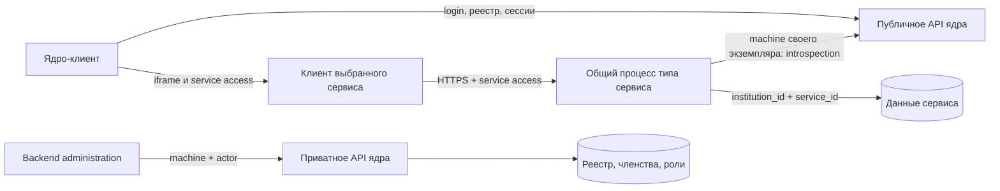

# API сервисов и работа облачных экземпляров

Версия предложения: `0.1.0`, 26 сентября 2026. Это проект MVP, а не описание работающих серверов. Код приложения и прежние документы не изменяются.

Три результата:

- [SERVICES_API_OPENAPI.yaml](SERVICES_API_OPENAPI.yaml) — HTTP-контракт сервисов, схемы, авторизация, ответы и примеры.
- [SERVICES_API_ENDPOINTS.txt](SERVICES_API_ENDPOINTS.txt) — плоский список операций из этого контракта.
- Этот документ — устройство экземпляров, последовательности, права, хранение и ограничения MVP.

Основания: [SPEC_MANIFEST.md](../../SPEC_MANIFEST.md), [CORE_API_OPENAPI.yaml](../../core/CORE_API_OPENAPI.yaml), [CORE_API_SPEC.md](../../core/CORE_API_SPEC.md) и код `backend`. Папки frontend, iframe-probe, web и отчёты docs/slop для проектирования не использовались. Нормативный формат машинного документа — [OpenAPI 3.1.1](https://spec.openapis.org/oas/v3.1.1.html). Общие схемы ядра скопированы в новый YAML, чтобы он открывался самостоятельно; при дальнейшем изменении ядра совместимость этих копий необходимо проверять.

## 1. Основное решение

**Один процесс на тип облачного сервиса, а экземпляр вуза — запись и область данных внутри него.** Для ста вузов достаточно трёх процессов: administration, schedule, user-profile. При добавлении вуза или установке расписания новый процесс не запускается. Локальный coursework работает отдельным процессом на стороне вуза и использует тот же механизм сессий.

Экземпляр имеет UUID `service_id`, ровно один `institution_id` и фиксированный `service_type`. В MVP у вуза максимум один экземпляр каждого типа, как уже установлено ядром. Настройки, назначения ролей, записи расписания и анкеты разных экземпляров разделены. Общими являются исполняемый код, пул соединений и статические файлы клиента.

Это логическая изоляция данных, не отдельная машина на вуз. Ошибка или компрометация общего процесса может затронуть обслуживаемые им вузы. Поэтому объединять administration с обычными сервисами в один workload не предлагаем: только administration должен иметь сетевой доступ к приватному listener ядра. Один процесс **для всех вузов одного типа** решает исходную задачу без изменения этой границы.

Для MVP достаточно одного PostgreSQL: отдельные схемы и роли БД для ядра и каждого сервиса, без доступа сервиса к таблицам ядра. В будущем процессы можно размножить за балансировщиком, не меняя контракт или идентичность экземпляров. Состояние, влияющее на корректность, уже хранится в БД, а не в памяти процесса.

## 2. Границы и владельцы данных

| Компонент | Что ему принадлежит |
| --- | --- |
| Ядро | Пользователи платформы, вузы, членства, профили admin/teacher/student, реестр сервисов, роли и назначения, все JWT и сессии |
| Administration | Публичный пользовательский фасад приватных операций ядра; собственной копии реестра или членств нет |
| Schedule | Учебные группы, состав групп, конкретные занятия |
| User-profile | Отображаемое имя, описание, должность и учёная степень человека в этом вузе |
| Coursework | Курсовые, файлы и результат проверки |
| Конфигурация платформы | Привязка экземпляра к процессу и его machine credential; утверждённые origins, меню и начальные роли типов |

«Профиль» ядра означает статус `admin|teacher|student`; «анкета» означает карточку в user-profile. Изменение должности не назначает teacher, а перевод в учебную группу не создаёт student. Один человек с двумя профилями имеет одну анкету, но две разные сервисные сессии с разными правами.

Сервисы не вызывают друг друга в MVP. Schedule и coursework оперируют UUID пользователей. Имена в их первом интерфейсе могут вводиться/показываться через известные UUID; обязательной зависимости от установленного user-profile нет. Общий каталог групп, импорт из учебных систем, расписание по неделям и синхронизация справочников сейчас не вводятся.

## 3. Адреса и общий контракт SDK

В OpenAPI общий раздел имеет четыре `servers`; доменные операции и HTML — только сервер своего типа. Это сборник контрактов, а не требование публиковать все маршруты на каждом сервере. В ENDPOINTS одинаковый общий путь указан один раз. Конкретный origin всегда определяется выбранным экземпляром, не жёстко записывается в клиент.

Предлагаемые адреса конфигурации:

| Тип | api_base_url | client_base_url | entrypoint_path |
| --- | --- | --- | --- |
| administration | `https://administration.platform.example/api/v1` | `https://administration.platform.example` | `/admin` |
| schedule | `https://schedule.platform.example/api/v1` | `https://schedule.platform.example` | `/schedule` |
| user-profile | `https://profiles.platform.example/api/v1` | `https://profiles.platform.example` | `/home`, `/users` |
| coursework | `https://coursework.university.example/api/v1` | `https://coursework.university.example` | `/coursework` |

Все адреса — примеры. Клиент и API одного типа предложено размещать на одном origin, отличном от origin ядра и других типов; это позволяет обойтись без CORS между ними. Контракт ядра также допускает раздельные API/UI origins: тогда API разрешает только точный зарегистрированный client origin, нужные методы и заголовки, включая Authorization, Content-Type, If-Match, Idempotency-Key; открывает для чтения ETag, Location, X-Request-ID, Retry-After и Content-Disposition. Cookies не используются. OPTIONS возвращает только сведения CORS, без данных экземпляра. На private API ядра публичный OPTIONS по-прежнему даёт 404.

`api_base_url` уже содержит `/api/v1`. Например, к нему добавляют `/schedule/events`; добавлять второй `/api/v1` нельзя. HTML entrypoint присоединяется к origin `client_base_url`, как в ядре. Установка cloud не принимает произвольные URLs.

Общая часть SDK:

- `GET /api/v1/health` — жив ли процесс. Успех не означает готовность всех экземпляров или ядра.
- `GET /api/v1/service` — карточка **текущего** экземпляра в формате `ServiceView`: UUID, тип, URLs, профиль, актуальные роли/permissions и отфильтрованные меню. Есть `locale=ru|en`, но нет переключателей tenant/profile. Полный manifest сервис публикует в ядро через уже существующий machine API; дополнительного публичного PUT manifest нет.
- HTML entrypoints и `/assets/{asset_name}` — статический клиент без учебных данных. Для загрузки HTML токен не нужен; данные появляются только после аутентифицированного API-запроса. Asset filenames плоские, с hash содержимого.

Собственных `/auth/token`, `/refresh` или `/logout` у сервисов нет. Обе пары пользовательских токенов выдаёт и обновляет ядро. На API сервиса принимается только service access, а не core access, refresh или machine token.

## 4. Как один процесс обслуживает экземпляры

### 4.1. Доверенная привязка

Процессу нужна привязка (`binding`) для каждого установленного экземпляра:

| Поле | Значение |
| --- | --- |
| `institution_id`, `service_id`, `service_type` | Неизменяемая идентичность экземпляра |
| `api_base_url`, `client_base_url` | Адреса из конфигурации платформы |
| `client_id`, защищённый machine secret | Credentials именно этого экземпляра |
| `binding_revision` | Версия доставки/ротации настроек |

Binding не принимается от браузера. Пользовательский JWT не создаёт binding и не регистрирует вуз. У процесса нет machine JWT «на все вузы»: для каждого обращения в ядро он выбирает credential по проверенному `service_id`.

Минимальный способ динамической доставки для облака — отдельная таблица конфигурации `provisioning.cloud_bindings` в том же PostgreSQL. Это **предложение внутреннего устройства платформы**, отсутствующее в текущем коде. Ядро при установке cloud записывает реестр, credential и binding в одной транзакции; облачный процесс имеет только SELECT собственных bindings, без доступа к core-таблицам. Доступ ограничивается типом сервиса средствами БД, а не одним WHERE в приложении: отдельные представления/права либо RLS с фиксированной ролью подключения. Administration не читает bindings остальных типов.

Machine secret хранится в этой области в зашифрованном виде; приватный ключ/ключ расшифрования своего типа доставляется процессу через секреты deployment. Для ядра достаточно ключа шифрования; в credential-таблице ядра остаётся только hash, как требует его спецификация. Используется готовый механизм защищённого хранения секретов, без собственного криптографического протокола. Secret не попадает в обычную конфигурацию клиента, API-ответы cloud, Git или логи. Это реализация уже предусмотренной «доставки credentials платформой», а не новый публичный API.

На запрос процесс получает binding из этой доверенной таблицы по проверенной паре UUID. Для небольшого MVP можно читать её на каждом запросе; отдельные очереди, polling workers, provisioning HTTP endpoints и согласование двух хранилищ не нужны. Доменные схемы подготовлены миграциями на весь тип: создание экземпляра не создаёт БД/схему/таблицы. Отсутствие доменных строк означает пустое расписание или незаполненную анкету.

Если требуется вынести ядро и сервисы в разные СУБД, такая транзакционная доставка перестанет работать; тогда потребуется отдельный механизм доставки. Это следующий этап, не скрытая зависимость MVP. Для локального coursework достаточно binding в серверной конфигурации вуза; секрет выдаётся по существующему API управления local credentials.

### 4.2. Изоляция внутри процесса

После аутентификации SDK создаёт неизменяемый **контекст одного запроса**: `institution_id`, `service_id`, `user_id`, `profile`, актуальные `roles/permissions`, `session_id`, `request_id`. Контекст передаётся обработчику и репозиторию явно. Нельзя хранить «текущий вуз» в глобальной переменной, менять общий объект клиента ядра под запрос или выбирать tenant из пользовательского заголовка.

Каждая доменная строка содержит `(institution_id, service_id)`. Каждый SELECT, UPDATE, DELETE и JOIN ограничен обеими координатами. Первичный/уникальный ключ ресурса и внешние ключи включают эти координаты: идентификатор группы A невозможно связать с занятием B. UUID сам по себе не является проверкой доступа.

Ключи файлов, idempotency, cache и фоновой очистки тоже начинаются с обеих координат. Если SQL-RLS добавляется для доменных таблиц, контекст соединения устанавливается только на время транзакции; возврат соединения в пул не должен переносить tenant следующему запросу. RLS не заменяет объектные проверки «своя работа»/«своя группа».

### 4.3. Нужна ли очередь доступа к экземплярам

Нет. Запросы вузов A и B обрабатываются конкурентно одним процессом. Сам «экземпляр» не надо открывать, захватывать и закрывать. Последовательность нужна для проверок **внутри запроса** и для конфликтующих изменений **одного ресурса**.

Для одной записи используется транзакция и версия ETag; конкурирующий редактор получает 412. Для группового состава — дополнительно уникальность принадлежности студента одной группе. Файлы и курсовые используют версию общего агрегата. Запросы к разным вузам не берут общий mutex. Пул БД и соединения к ядру общие и ограниченные; лимиты пользовательских запросов считают с учётом экземпляра, чтобы один вуз не занимал весь процесс.

## 5. Порядок доступа

### 5.1. Открытие сервиса пользователем

1. Shell входит в ядро через MAX, получает свои вузы и выбирает вуз.
2. Получает назначенные профили; пользователь выбирает один. `admin` не выбирается автоматически вместо student/teacher.
3. Запрашивает список сервисов ядра с этим `profile` и `locale`; выбирает экземпляр и меню.
4. Создаёт service session через `POST /api/v1/institution/{institution_id}/service/{service_id}/session`. Core access и service refresh остаются в памяти shell.
5. Загружает HTML выбранного меню в отдельный iframe. Передаёт только access **этого** экземпляра через проверенный handshake.
6. Iframe вызывает `GET /api/v1/service`, сверяет возвращённый контекст с переданным shell и затем обращается к своему доменному API.
7. При обновлении токена iframe просит shell; shell сериализует refresh семьи и вызывает ядро. Сервисный backend не выдаёт токены.
8. При смене вуза или профиля shell уничтожает старый iframe, по возможности отзывает его service session, затем повторяет выбор. Разные вкладки могут иметь разные профили одновременно.

Нет обязательного порядка «сначала user-profile, затем schedule»: каждый сервис доступен независимо. Обязателен только порядок: **вуз → профиль → экземпляр → сервисная сессия → конкретная операция**.

### 5.2. Обработка каждого защищённого запроса

1. Проверить формат Authorization и service JWT: подпись по JWKS ядра, фиксированные issuer/RS256, `token_use=service_access`, сроки, обязательные claims и `aud=service:{service_id}`. Поля неподтверждённого JWT не используются для сетевых запросов или загрузки credentials. Неизвестный kid обрабатывается по ограниченному refresh JWKS из CORE_API_SPEC.
2. По подписанным `institution_id/service_id` найти **заранее зарегистрированный** binding. Тип binding должен совпасть с текущим сервисом, institution — с JWT. Чужой известный binding — 404. Если подписанный токен корректен, но binding ещё недоступен, — 503 INSTANCE_NOT_READY; это не запускает автоматическую регистрацию. Без валидного JWT — 401.
3. Получить machine access из credentials именно этого binding. Машинный access можно переиспользовать до exp с запасом 30 с; одновременные обмены одного credential объединяются. На 401 ядра допускается один новый обмен; бесконечных повторов нет.
4. Выполнить online introspection входного service access в ядре. В MVP это обязательно **для всех** защищённых операций, включая чтение. `active=false` → 401 UNAUTHENTICATED. При active=true повторно сверить UUID, audience, subject и профиль с JWT и binding; права взять из introspection, а не из старого снимка JWT. Ошибка связи/доверенной machine-конфигурации → 503, без перехода к offline-правам.
5. Проверить разрешённый профиль и permission операции. Затем найти объект только в текущем экземпляре и проверить объектные ограничения. Чужой/невидимый объект → 404, недостаточные права на операцию в своём экземпляре → 403. Меню не является авторизацией.
6. Проверить If-Match/Idempotency-Key, тело и доменные связи; выполнить короткую транзакцию. При успехе вернуть новую версию ресурса. Во время медленной загрузки PDF сетевые и файловые операции не удерживают долгую транзакцию БД.

Introspection не кэшируется. Поэтому отключение экземпляра, снятие профиля и logout блокируют **следующий** online check, без пяти минут offline-окна. Уже прошедший проверку запрос может завершиться: общей транзакции между ядром и доменной БД нет. Это явно допустимая граница MVP. Перед commit загрузки файла проверка повторяется; длительная передача скачивания повторно не авторизуется на каждом байте.

Проверка связи с другим пользователем выполняется доступным machine endpoint ядра `GET /api/v1/internal/service/{service_id}/users/{user_id}/profiles`. Machine credential даёт чтение профилей только в вузе этого экземпляра. Нет membership/нужного профиля → 422 INVALID_REFERENCE при вводе ссылки; чтение недоступной анкеты → 404. Сбой ядра → 503. UUID не проверяется через прямой SELECT таблиц ядра.

## 6. Создание, отключение и перезапуск

### 6.1. Первый вуз

Оператор в рамках bootstrap ядра создаёт active вуз, первого owner, обязательный administration instance, его системные роли, credential и binding. Все схемы и типовые клиенты уже развёрнуты. Открывать пользовательские сессии до завершения bootstrap нельзя. Включение/удаление administration через UI запрещено ядром.

### 6.2. Установка cloud через интерфейс

1. Администратор вызывает публичный `POST /api/v1/administration/services` с типом cloud и Idempotency-Key.
2. Backend administration проверяет actor и вызывает private POST ядра с тем же ключом/телом. Он не получает и не передаёт credential устанавливаемого облачного сервиса.
3. Ядро в одной транзакции создаёт UUID экземпляра, URLs/manifest из каталога, начальные роли, machine credential и защищённый binding в области provisioning. Проверяются уникальность типа в вузе и idempotency.
4. После commit возвращается 201. Облачный экземпляр, как в текущем контракте ядра, уже `enabled=true`; запрос к процессу типа находит binding и пустые доменные данные. Установка не запускает процесс и не вызывает пользовательский URL.
5. Если запись binding/секрета не удалась, транзакция не публикуется, ответ 503. Если процесс сервиса недоступен после успешного commit, установка всё равно существует; пользовательский доступ временно недоступен. 201 означает регистрацию, не проверку здоровья удалённого процесса.

Повтор того же ключа не создаёт новых UUID, credentials, ролей или bindings. Новая установка после удаления имеет новый UUID и пустые данные; старые доменные строки по прежнему UUID не «подхватываются». Начальные роли создаются до первого доступа, а не лениво из GET. Не требуется distributed transaction: для MVP реестр и delivery binding находятся в одном PostgreSQL; доменное наполнение при установке отсутствует.

### 6.3. Local и последующие изменения

Local создаётся выключенным, с утверждёнными URLs. Администратор выдаёт credential через administration; переносит показанный один раз секрет в серверную конфигурацию вуза. Backend local обменивает его на machine JWT, создаёт начальную роль и публикует manifest через API ядра. После этого администратор включает экземпляр. Секрет доступен только уполномоченному администратору при выдаче, не сохраняется в browser storage и не встраивается в клиент. Для cloud такая выдача запрещена.

Disabled instance сохраняет данные и может использовать machine API для настройки; пользовательский доступ запрещён introspection. Удаление реестровой записи отзывает credentials и сессии, а binding деактивируется в той же транзакции платформы. Доменные файлы и строки сразу не уничтожаются. Перезапуск читает существующие bindings и данные; миграции не создают новый UUID вместо прежнего.

Платформа ротирует cloud credential через доверенный provisioning-механизм: создать второй, атомарно переключить binding и увеличить revision, затем отозвать старый. Вуз управляет только local credentials. Кэш machine JWT привязан к credential_id/revision, а не только к вузу. Положительный кэш пользовательских прав отсутствует, поэтому старый binding не даёт обхода отзыва в ядре.

## 7. Публичный API администрирования

Префикс сервиса: `/api/v1/administration`. Он необходим, поскольку браузер не имеет доступа к `/api/v1/institution/{institution_id}/internal` ядра.

Соответствие механическое: публичный суффикс после `/administration` добавляется к private префиксу ядра, а `institution_id` подставляется из actor JWT. Например:

| Пользователь → administration | Administration → private ядро |
| --- | --- |
| `GET /api/v1/administration/members` | `GET /api/v1/institution/{actor_institution}/internal/members` |
| `PUT /api/v1/administration/members/{user_id}/profiles` | `PUT /api/v1/institution/{actor_institution}/internal/members/{user_id}/profiles` |
| `POST /api/v1/administration/services` | `POST /api/v1/institution/{actor_institution}/internal/services` |

Все операции перечислены в OpenAPI; `x-core-operation` указывает точный метод/путь/operationId ядра. Публичная операция принимает один ServiceBearer. Backend сам задаёт `Authorization: Bearer <machine administration>` и `X-Actor-Token: <исходный service access>`. Присланные браузером X-Actor-Token, tenant-заголовки, upstream URL и machine credentials не используются; arbitrary proxy endpoint отсутствует. `service_id` в суффиксе — целевой сервис управления **в этом вузе**, не возможность выбрать чужой administration binding.

Тела, фильтры, пагинация и strong ETag совпадают с ядром. Фасад пересылает If-Match и Idempotency-Key; Location заменяет на свой публичный путь, private URL не выдаёт. Ошибки валидации, прав actor и конфликтов ядра сохраняют смысл. Сбой транспорта, неправильный machine credential или неожиданный ответ ядра дают 503. X-Request-ID ответа и error.request_id принадлежат публичному запросу; upstream request ID остаётся в серверном журнале для связи. Выдача секретов не повторяется автоматически при потере ответа.

Проверки последнего owner, неизменяемых системных ролей, запрета удаления administration и scope целевого сервиса выполняются ядром заново. Administration не может сделать их слабее. Назначения ролей собственного типа меняет только owner; `roles.manage` сам по себе этого не разрешает. Остальные permissions и роли administration без изменений берутся из §2.3 CORE_API_SPEC.

## 8. Права и меню обычных сервисов

Ниже — конкретизация словарей типов, которые ядро уже предусматривает, но пока не перечисляет для доменных сервисов. Это начальные данные платформы, а не новые HTTP endpoints ядра. Права не выводятся из имени роли. Профиль admin сам по себе не даёт доступа к учебным данным.

| Тип | Permission | Назначение |
| --- | --- | --- |
| schedule | `schedule.read_all` | Администратору читать все группы/занятия экземпляра |
| schedule | `schedule.write` | Администратору создавать, менять и удалять занятия |
| schedule | `groups.manage` | Администратору менять группы и читать/заменять их состав |
| user-profile | `profiles.manage` | Администратору менять должность и степень участника |
| coursework | `coursework.manage` | Администратору читать/удалять работы экземпляра |

Начальные роли: `schedule_editor` — все три права schedule; `profile_editor` — profiles.manage; `coursework_manager` — coursework.manage. У всех allowed_profiles=[admin]. Начальная роль не назначается всем администраторам автоматически: owner назначает её конкретному user/profile/instance через administration. Cloud определения создаёт платформа при установке, local — backend при настройке через machine API. Полномочия обычных student/teacher определяются непосредственно профилем и принадлежностью объекта; пустой массив roles допустим.

В каталоге типов administration поддерживает только admin; остальные три типа — admin, teacher, student. Профиль из path управления назначениями ролей — профиль целевого участника, а не переключение профиля вызывающего actor.

Пользовательского конструктора определений ролей в MVP нет. Для него уже существует machine API ядра, но публиковать его без отдельной модели авторизации не требуется. Если оператор создаёт нестандартные роли, write не подразумевает read: нужно явно включить права чтения для UI и получения ETag.

| Тип / ID меню | Название, путь | Профили | required_permissions |
| --- | --- | --- | --- |
| administration / `administration` | Администрирование, `/admin` | admin | [] |
| schedule / `schedule` | Расписание, `/schedule` | student, teacher | [] |
| schedule / `schedule_admin` | Расписание, `/schedule` | admin | [schedule.read_all] |
| user-profile / `home` | Главная, `/home` | admin, teacher, student | [] |
| user-profile / `users` | Пользователи, `/users` | admin, teacher, student | [] |
| coursework / `coursework` | Курсовые, `/coursework` | student, teacher | [] |
| coursework / `coursework_admin` | Курсовые, `/coursework` | admin | [coursework.manage] |

Названия хранятся картами переводов с обязательным ru; для en без перевода применяется ru. `order` в пределах типа: home=0, users=10, остальные=0. Два меню разных профилей могут вести на один HTML. Доступность конкретной кнопки admin-клиента зависит от актуального permission, а не только от видимости меню.

## 9. Доменные правила

### 9.1. Расписание

Группа — UUID и имя. Состав — отдельный агрегат `group_id + user_ids` с отдельным ETag. Один student может состоять максимум в одной группе текущего schedule instance. Это осознанное упрощение MVP; подгрупп, факультативных групп и истории состава нет. До назначения группы расписание студента пустое, не ошибочное.

Группы создаёт/переименовывает/удаляет admin с groups.manage. PUT состава атомарно заменяет список до 500 UUID; все должны сейчас иметь student по ядру. Проверка существования профиля происходит перед локальной транзакцией и не даёт распределённой гарантии против одновременного удаления membership. Такое удаление блокирует сервисную сессию; оставшаяся строка группы доступа не даёт. GET состава для редактора показывает сохранённые UUID, включая устаревшие, чтобы их можно было удалить. Возвращать чужие ФИО из ядра этот endpoint не пытается.

Перевод между группами — сначала удалить из старой, затем добавить в новую. В промежутке расписание может быть пустым; отдельный API атомарного перевода для демо не нужен. Уникальный индекс по `(institution_id, service_id, user_id)` не допускает две группы при гонке. Удалить непустую группу или группу, упомянутую любым занятием, нельзя: 409 GROUP_IN_USE.

Занятие — конкретный интервал UTC, заголовок, место/описание, непустые списки групп и teacher UUID. При записи start < end, ссылки на группы того же экземпляра, преподаватели имеют актуальный teacher. Время хранится UTC Z; клиент отображает в выбранной настройке часового пояса, по умолчанию Europe/Moscow. Нового поля часового пояса в вуз ядра не добавляем. Повторяющиеся недели разворачиваются редактором в отдельные занятия. Пересечения занятий допускаются; автоматическое составление/проверка конфликтов вне MVP.

Студент видит события своей **текущей** группы; преподаватель — события со своим UUID среди teacher_ids; admin с schedule.read_all — все. Фильтр по группе/преподавателю только сужает этот набор. Диапазон обязателен, не более 31 суток, пересечение с ним считается как `starts_at < to AND ends_at > from`; период может включать отменённые события. Прямой запрос недоступного события — 404. Порядок — starts_at, затем id.

PUT меняет всё занятие; `status=cancelled` сохраняет отмену для пользователей. DELETE применяется для ошибочной записи и убирает её из выдачи. Никаких push-уведомлений или интеграции с ботом этот контракт не обещает.

### 9.2. Анкеты

Карточка общая для всех профилей одного человека в одном вузе. Сам человек изменяет только `display_name` и `about`. Отображаемое имя вводится пользователем и не считается подтверждённым паспортным ФИО. Должность и степень задаёт admin с profiles.manage; nullable поля допускают null для очистки. Телефон, MAX ID, адрес, паспорт и закрытые учебные сведения не входят в карточку.

Все поля карточки доступны действующим участникам того же вуза. Для демонстрации используются учебные/вымышленные анкетные сведения; конкретные правила публикации реальных сведений определяются перед пилотом. Юридический TODO манифеста этим контрактом не закрывается.

GET своей или чужой действующей карточки без сохранённой строки возвращает виртуальную пустую карточку: display_name/position/academic_degree=null, about="". GET не записывает данные. ETag виртуальной версии стабилен и привязан к экземпляру/user_id; первая PATCH создаёт строку атомарно, вторая параллельная PATCH со старым ETag получает 412. Академическая PATCH может создать карточку без имени; владелец заполнит имя позже. Оба пути карточки используют одну версию.

Каталог содержит только сохранённые карточки с непустым display_name, а не всех участников ядра. В существующем machine API нет операции перечисления участников, поэтому обещать полный реестр было бы несовместимо с ядром. При GET по известному UUID членство проверяется доступным endpoint профилей. При поиске/списке сервер берёт не более limit кандидатов по user_id и для каждого проверяет текущее членство; недоступных пропускает, cursor указывает последнего **просмотренного** кандидата. Поэтому даже пустая страница может иметь next_cursor. Сбой ядра прерывает запрос с 503, а не подставляет непроверенные карточки. Для размеров демо это приемлемо; batch-проверка — возможное отдельное расширение ядра в будущем.

После удаления membership доменная карточка сохраняется, но не выдаётся. Повторное добавление того же UUID в вуз возвращает доступ к прежним данным; то же относится к составу групп и курсовым. Истории разных периодов членства в текущей модели нет. Автоматическая физическая очистка по снятию профиля не вводится.

### 9.3. Локальные курсовые

Минимальная единица — одна работа с неизменяемыми автором, проверяющим и заголовком, текущим PDF и результатом проверки. Студент при POST выбирает teacher_id из известных ему UUID; сервис проверяет наличие teacher в этом вузе. Назначения преподавателей для отдельных дисциплин/групп в ядре нет, поэтому в MVP допустим любой действующий teacher вуза. Дополнительного справочника заданий и привязки к расписанию нет.

POST принимает multipart: title, teacher_id, один file. Автор — только `sub` JWT. Разрешён непустой PDF до 20 MiB; весь multipart до 21 MiB, без лишних/повторяющихся частей. Проверяются размер фактического потока, заявленный тип, сигнатура и возможность прочитать структуру PDF; Content-Length и расширения недостаточно. Ошибка размера — 413, формата — 415. PDF не исполняется и не рендерится на сервере; структурная проверка не является антивирусом.

| Текущее состояние | Действие | Результат |
| --- | --- | --- |
| Нет работы | student POST с файлом | submitted, version=1, review=null |
| submitted или changes_requested | Автор PUT нового файла | submitted, version+1, review=null |
| submitted | Назначенный teacher PUT review | accepted или changes_requested, отзыв относится к текущей version |
| accepted | Автор PUT файла или DELETE | 409 INVALID_STATE |
| Любое | admin с coursework.manage DELETE | Работа скрыта, файл поставлен на очистку |

Автор удаляет собственную submitted/changes_requested; teacher не удаляет и не подменяет файл. Проверять свою работу запрещено даже при наличии обоих профилей. Administration-профиль с coursework.manage может читать/удалять, но не выдавать себя за проверяющего. Изменение уже вынесенного решения и переназначение teacher не входят в MVP; при необходимости студент создаёт новую работу. Автоматической уникальности «одна курсовая на студента» нет.

GET объекта, PUT файла, PUT review и DELETE используют **одну версию агрегата работы**. If-Match берётся из GET работы, поэтому проверка старого PDF одновременно с новой загрузкой завершится 412. Student/teacher видят только авторские/назначенные работы, admin с permission — все работы экземпляра.

Файл сначала потоково записывается во временное хранилище; размер и SHA-256 вычисляются по байтам. После проверок и повторной авторизации он сохраняется по новому неизменяемому ключу `(institution_id, service_id, submission_id, file_version, random_id)`. В короткой транзакции блокируется работа, проверяются версия/состояние и сохраняется ссылка на уже доступный файл. При конфликте файл остаётся сиротой и удаляется очисткой; успешный ответ не возвращается до commit.

При замене старый файл не перезаписывается и не удаляется до commit. В той же транзакции БД записывается отметка на его последующую очистку. Для небольшого локального демо это каталог файлов на постоянном томе и таблица задач очистки; отдельный брокер/объектное облако не нужны. Периодическая очистка в том же процессе идемпотентна и подбирает временные/неиспользуемые файлы после сбоя. БД и том резервируются согласованно. Отсутствующий ожидаемый файл — 503 FILE_STORAGE_UNAVAILABLE, не успешный пустой PDF.

Очистка не трогает свежие файлы: минимальный возраст кандидата — 24 часа, максимальная длительность загрузки — 10 минут. Перед удалением проверяется отсутствие актуальной ссылки из БД. Так файл между окончанием записи и commit не будет ошибочно принят за сироту. Текущий файл работы не удаляется по одному лишь возрасту.

Скачивание — авторизованный fetch `GET .../file`, затем временный Blob URL в клиенте; JWT в URL не передаётся. Ответ attachment + nosniff, без публичного постоянного URL, redirect или Range API. Исходное имя очищается от путей/управляющих символов и используется только для отображения/download, не как путь хранения. Локальный сервер должен быть доступен устройству пользователя по HTTPS: адрес внутри закрытой LAN сам по себе для MAX недоступен.

## 10. Общие правила HTTP, конкуренция и сбои

- JSON UTF-8, snake_case, UUID строками, даты UTC RFC 3339 с Z. Неизвестные поля тела отклоняются; JSON syntax — 400, неверная структура — 422. PATCH непустой; отсутствующее поле не изменяется. Исключение для null явно задано только nullable полями анкеты. У имён/заголовков удаляются крайние пробелы, пустой результат запрещён; описание может быть пустым. Ошибка порядка/диапазона времени — 422 INVALID_TIME_RANGE, неверная доменная ссылка — 422 INVALID_REFERENCE.
- ErrorResponse сохраняет оболочку ядра; новые доменные коды определены в OpenAPI. У каждого API-ответа X-Request-ID; у ошибок тот же UUID в error.request_id. Тела токенов, credentials, файлов и анкет в логи не пишутся. JSON и downloads — no-store.
- Для изменения существующего доменного ресурса обязателен один strong If-Match: отсутствие — 428, устаревшая версия — 412; wildcard/списки не поддерживаются. ETag непрозрачный, учитывает tenant, агрегат и его версию. Авторизация и область доступа проверяются до сравнения версии. GET списка не заменяет GET отдельного ресурса для получения ETag. Administration сохраняет исключение ядра: отзыв credential не требует If-Match.
- Новые доменные POST создания группы/занятия/работы требуют UUID Idempotency-Key. Область ключа: instance, user, profile, метод и путь. Запись хранится 24 ч в БД; сравнивается каноническое тело, для multipart — поля, очищенное имя и SHA-256 файла. Одинаковые параллельные создания сериализуются; другое тело с тем же ключом — 409 IDEMPOTENCY_CONFLICT. Перед replay проверяются текущие права. Удалённый/ставший невидимым результат не восстанавливается: 404. Успешный replay возвращает исходные 201, тело и ETag; для нового изменения клиент читает актуальную карточку.
- Операции administration сохраняют именно idempotency/preconditions ядра. В частности, выдача credential и добавление membership не получают выдуманной гарантии replay. При потерянном ответе добавление проверяется GET; при выдаче секрета — просмотр списка credentials, создание нового и отзыв неизвестного по правилам ядра.
- PUT/PATCH после потери ответа не повторяются со старым If-Match бесконечно: клиент перечитывает ресурс и сверяет результат. Отклонённый запрос не делает частичного изменения. Повторы транспорта безопасны только для чтения либо явно идемпотентного создания.
- Пагинация: limit 1–100, по умолчанию 50; items/next_cursor. Курсор на 15 минут связан с tenant, user, profile, актуальными permissions и фильтрами/locale, не даёт snapshot. При смене прав cursor недействителен: 400 INVALID_CURSOR. Обычный порядок UUID ASC, события — starts_at,id. Если изменения видимости исключили запись, она не возвращается даже с прежним cursor.
- Доменные лимиты MVP: 120 запросов/мин на `(instance,user)`, загрузки PDF дополнительно 10/мин и максимум 2 одновременные на пользователя; 429 с Retry-After. Общий размер multipart ограничивается и ingress, и backend. Значения конфигурируемы; лимит machine ядра уже задан его контрактом, поэтому нельзя бесконтрольно распараллеливать проверки каталога.
- Сетевые обращения к ядру имеют конечный timeout (для MVP 3 с на попытку). Недоступность ядра/БД не превращается в успех: 503 SERVICE_UNAVAILABLE. При 429 upstream пользователь получает 429/Retry-After. Неизвестная ошибка скрывается за 500 INTERNAL_ERROR. Подробности остаются в серверных журналах.

## 11. Минимальный протокол shell ↔ iframe

Это браузерный протокол SDK, а не HTTP и потому описан здесь. Он реализует уже принятую ядром передачу service access, не создавая новую систему авторизации.

Сообщения — объекты с `type`, `protocol_version=1` и `channel_id` (новый UUID на каждую загрузку iframe):

| Направление | type | Дополнительные поля |
| --- | --- | --- |
| Shell → iframe после load | `platform.init` | Нет токенов; инициирует канал |
| Iframe → shell | `service.ready` | Подтверждает channel_id |
| Shell → iframe | `platform.context` | institution_id, service_id, profile, api_base_url, locale, access_token, expires_at (UTC) |
| Iframe → shell | `service.refresh_requested` | request_id (UUID) |
| Shell → iframe | `platform.access` | request_id, access_token, expires_at |
| Shell → iframe | `platform.session_ended` | reason: expired, revoked, context_changed или unavailable |

Обе стороны используют точный `targetOrigin`, сверяют `event.origin`, `event.source`, protocol_version и channel_id. Shell знает origin из реестра, iframe знает разрешённый origin shell из deployment-конфигурации. Применяется sandbox с нужными UI-возможностями и отдельным origin; точная политика embedding/CSP зависит от размещения MAX, но не должна лишать postMessage проверяемого origin. Если выбранный sandbox даёт opaque origin `null`, этот handshake нельзя ослаблять до `*` — нужно исправить конфигурацию размещения.

Iframe отвечает ready только на init от разрешённого родителя. При повторном load создаётся новый канал, старые сообщения/результаты запросов отбрасываются. Полученный api_base_url должен совпасть с настроенным разрешённым API origin клиента; iframe не отправляет bearer на URL из случайного сообщения. Значения контекста нужны UI, но backend доверяет только проверенному JWT и introspection.

Refresh запрашивается перед expires_at либо один раз после 401. Shell объединяет конкурентные запросы, делает один refresh в ядро и возвращает новый access. При провале/потере refresh-ответа не переиспользует старый refresh: создаёт новую service session либо завершает её по правилам ядра. Iframe прекращает новые запросы после session_ended; повторный API 401 после обновления не запускает цикл. При первоначальном GET /service несовпадение контекста завершает канал. Токены хранятся только в памяти, не в URL, HTML, localStorage или логах.

## 12. Минимальное хранение и критерии приёмки

| Область | Основные ключи/ограничения |
| --- | --- |
| Bindings платформы | UNIQUE service_id, неизменяемые institution/type, версия credential; доступ runtime только своего типа |
| Группы и состав | PK tenant+group_id; UNIQUE tenant+нормализованное имя; UNIQUE tenant+student_id; состав имеет отдельную revision |
| Занятия, группы занятий, преподаватели | PK tenant+event_id; составные FK на группы; revision события |
| Анкеты | PK tenant+user_id, revision; поля по OpenAPI |
| Курсовые | PK tenant+submission_id; student_id, teacher_id, status, version, revision, file key/hash/size, review |
| Технические записи сервиса | Idempotency с UNIQUE scope+key; аудит действий; для coursework — надёжная очередь очистки в таблице БД |

Здесь tenant — пара institution_id/service_id. Таблицы доменных сервисов не ссылаются SQL FK на закрытые таблицы ядра. Они хранят UUID внешних субъектов и проверяют их через контракт ядра. Сроки хранения учебных данных/аудита и физического удаления определяются отдельно от технических 24 часов idempotency; DELETE экземпляра не обещает уничтожение всех копий данных.

Критерии для последующей реализации, без добавления тестового кода сейчас:

1. Два вуза с одним URL schedule одновременно работают в одном процессе; JWT A и ID объекта B не читают/не изменяют B. Проверяется также параллельная работа через пул соединений.
2. Body/query/header не переключают tenant/profile. Core, machine и refresh токены не принимаются вместо service access; JWT чужого типа не даёт доступ.
3. Установка cloud атомарно создаёт реестр и binding, повтор ключа не плодит credentials; новая установка после удаления не наследует данные старого UUID.
4. Перезапуск не теряет данные, роли и idempotency. Отозванный credential не позволяет продолжить работу на старом machine JWT. При отказе ядра API отдаёт 503, без offline fallback.
5. Public private-префикс ядра остаётся закрыт; administration не превращается в произвольный proxy. Owner-only и последний owner сохраняются при параллельных запросах.
6. Student без группы получает []; student/teacher не читают чужие занятия. Конкурентное назначение одному студенту двух групп не проходит. Снятие membership не оставляет доступа по старой доменной записи.
7. Обычный пользователь не меняет степень/должность; admin без profiles.manage тоже. Параллельное первое заполнение анкеты даёт один успех и один 412. Удалённый участник отсутствует в каталоге и недоступен по UUID.
8. Скачивание чужой курсовой даёт 404. Подмена student_id отклоняется схемой. Самопроверка не проходит после переключения на teacher. Проверка старой версии одновременно с новым файлом даёт 412.
9. Повтор upload с тем же ключом/байтами не создаёт вторую работу; другие байты дают 409. Файл сверх лимита — 413, недопустимый формат — 415. Обрыв загрузки/сбой commit не делает временный файл доступным; очистка после рестарта не удаляет текущий файл.
10. Поддельные postMessage, сообщения старого iframe и ответы старого refresh не принимаются. Refresh хранится только shell; смена профиля закрывает прежний контекст.

Для документации проверяются OpenAPI 3.1, все ссылки, уникальность operationId, path-параметры, примеры, точное соответствие ENDPOINTS и сохранность исходных файлов. Такая проверка подтверждает согласованность документов, а не готовность реализации.
